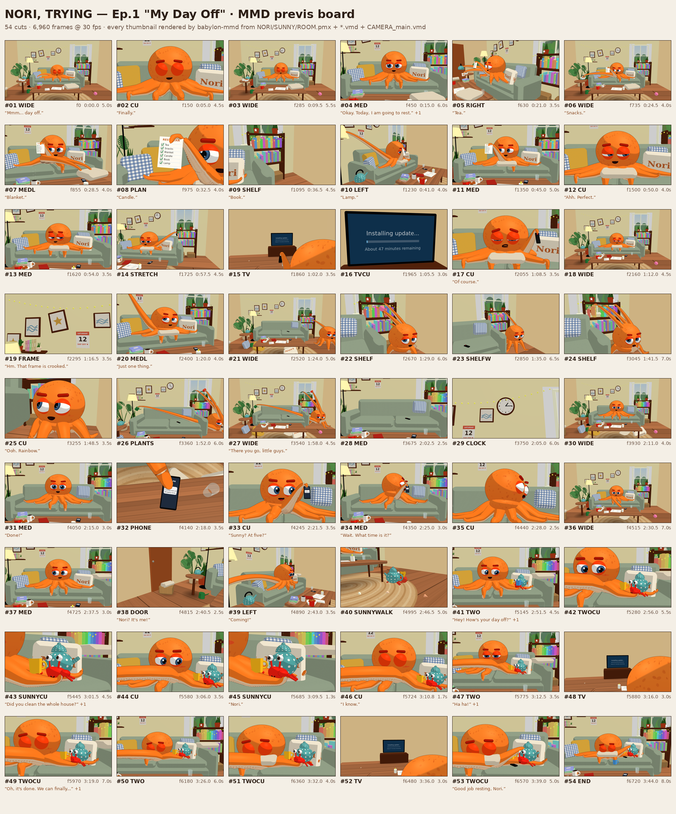

# NORI, TRYING — Ep.1 "My Day Off" · MMD 프리비즈 패키지

Three.js로 만든 에피소드 본편(232초, 컷 54개)을 **MikuMikuDance에서 그대로 열 수 있는 파일**로 내보낸 것입니다.
블렌더나 언리얼 없이, MMD만으로 이 에피소드의 레이아웃, 연기, 카메라 워크를 재생하고 고칠 수 있다는 것을 보여 주는 게 목적이에요.



## 들어 있는 파일

| 파일 | 내용 |
| --- | --- |
| `NORI.pmx` | 노리. 152본: 몸과 얼굴 부품 15본, 다리 8개 × 17본 체인. 모프 6개(입 벌림, 미소, 숨쉬기, 홍조) |
| `SUNNY.pmx` | 소라게 써니. 22본, 모프 3개(눈 깜빡임, 입) |
| `ROOM.pmx` | 거실 세트 전체와 움직이는 소품. 145본, 모프 84개(김, 먼지, 촛불 등 크기 애니메이션) |
| `NORI.vmd` · `SUNNY.vmd` · `ROOM.vmd` | 각 모델의 모션. 0–6959프레임, 30fps |
| `CAMERA_main.vmd` | 본편 카메라(키 439개, 컷 54개)와 시간대별 조명(키 25개) |
| `tex00–34.png` | 텍스처. PMX와 같은 폴더에 두세요 |
| `previs_board.png` | 컷마다 위 파일만으로 렌더한 콘티. MMD 프레임 번호와 대사 포함 |
| `compare_threejs_vs_mmd.png` | 원본 Three.js 렌더와 MMD 파일 재생 비교 |
| `export_report.json` | 수치 리포트(모델·모션 크기, 피팅 오차, 컷 목록) |

음악·대사 WAV(`ep01-main.wav`, 44.1kHz/16bit)는 용량(41MB) 때문에 저장소에 넣지 않았습니다. 이렇게 만들 수 있어요:
`ffmpeg -i ../audio/ep01-main.mp3 -ar 44100 -ac 2 -c:a pcm_s16le ep01-main.wav`

## MMD에서 여는 법 (MikuMikuDance 9.32 기준)

1. `ROOM.pmx`, `NORI.pmx`, `SUNNY.pmx`를 차례로 불러옵니다. 모델 읽기 또는 창에 드래그.
2. 각 모델을 선택한 뒤 이름이 같은 `.vmd`를 불러옵니다. 모델 이름과 모션 이름은 일치합니다.
3. 모델 선택 칸에서 "카메라·조명"을 고르고 `CAMERA_main.vmd`를 불러옵니다.
4. 파일 → 음성 읽기로 `ep01-main.wav`를 불러오면 0프레임부터 대사와 음악이 맞습니다.
5. 출력 크기는 16:9(예: 1920×1080), 프레임레이트는 30fps로 하세요. 카메라 화각은 세로 기준입니다.

## 변환 규칙

- **좌표계**: MMD는 왼손 좌표계라 z를 뒤집었고, 1m = 12.5 MMD 단위(1단위 ≈ 8cm)로 맞췄습니다.
- **카메라**: 키마다 주시점, 거리(음수), 회전 (rx, ry, 0), 정수 화각을 저장합니다. 카메라 위치는 `주시점 + R_y(ry)·R_x(rx)·(0,0,|거리|)`입니다(오른손 좌표 표기). 컷 전환은 연속 프레임 키 두 개로 처리했습니다.
- **움직이는 물체**: 하나에 본 하나를 줬습니다(全ての親 아래). 크기 애니메이션은 축별 정점 모프로, 페이드는 재질 모프로 옮겼습니다. 숨겨지는 물체는 바닥 아래 80m로 내립니다.
- **다리(촉수)**: 엔진에서 매 프레임 새로 만드는 튜브를 17본 체인으로 피팅했습니다. 링 단면의 법선과 접선으로 비틀림까지 맞췄고, 관절 사이 중간 링 오차는 중앙값 0.35mm, 99%가 8.4mm 이내, 최대 2.4cm입니다.
- **키 줄이기**: 선형 보간했을 때 위치 0.01단위, 회전 0.086°, 모프 0.004 이상 벗어나는 프레임만 키로 남겼습니다.

## 검증 (2026-10-04)

| # | 방법 | 결과 |
| --- | --- | --- |
| 1 | `tools/mmd_verify.py`: 내보내기 코드와 별개로 PMX 2.0·VMD 규격대로 다시 읽음 | 7개 파일 모두 마지막 바이트까지 읽힘. 인덱스·본 이름(SJIS 15바이트)·가중치·모프 값 범위·키 중복 이상 없음 |
| 2 | three-mmd-loader(GitHub `takahirox/three-mmd-loader`, 2026-10-04 커밋 `ce16471`)의 MMDParser | 모델 3개, 모션 3개, 카메라 모두 파싱됨. 모션의 모든 본 이름이 모델과 일치 |
| 3 | babylon-mmd 1.3.0 + Babylon.js 9.29.0으로 실제 로드·재생·렌더 | 카메라 위치가 엔진과 0.01단위(약 0.8mm) 이내로 일치. 써니 본의 월드 위치가 엔진과 1e-6 이내로 일치. 54컷 렌더 결과는 위 보드 |

카메라 공식은 babylon-mmd(`mmdCamera.pure.ts`), Blender mmd_tools(`core/camera.py`, YXZ), saba(`MMDCamera.cpp`)의 구현을 비교해서 정했습니다. 세 곳 모두 yaw → pitch 순서입니다.
three-mmd-loader의 카메라 클립은 X→Y 순서이고 주시점까지 회전시키기 때문에, 주시점이 원점이 아닐 때 MMD와 위치가 조금 다르게 나옵니다. 그래서 이 패키지는 다른 세 구현 쪽에 맞췄습니다.

## 한계

- 실제 MikuMikuDance.exe(Windows)에서는 아직 열어 보지 못했습니다. 위 세 구현으로 검증했습니다.
- MMD 조명은 평행광 하나뿐입니다. 엔진의 점광원(램프, 촛불, TV 빛), 블룸, 피사계 심도, 컬러 그레이딩은 옮겨지지 않습니다. 그래서 MMD 툰 셰이딩 룩으로 보입니다.
- TV, 휴대폰, 계획표 화면은 63초 시점 이미지로 고정됩니다.
- 다리를 늘릴 때 가늘어지는 효과는 본으로 표현할 수 없어서 빠졌습니다.
- 본편만 내보냈습니다. 9:16 쇼츠 카메라는 포함되지 않습니다.
- 모델의 바운딩 박스는 쉬는 자세 기준입니다. 일부 뷰어(예: Babylon)에서는 메시 컬링을 꺼야 합니다(`alwaysSelectAsActiveMesh`).

## 다시 만들기

```sh
node tools/mmd_capture.mjs --out <capture> --three <node_modules/three>   # 6,960프레임 캡처, 렌더링 없음
python3 tools/mmd_build.py <capture> mmd [soundtrack.wav]                 # PMX / VMD / 텍스처 / 리포트
python3 tools/mmd_verify.py mmd                                           # 독립 파서 검증
```

`tools/mmd_check/`에는 three-mmd-loader 파서 검사와 babylon-mmd 렌더 검사 스크립트가 들어 있습니다.
